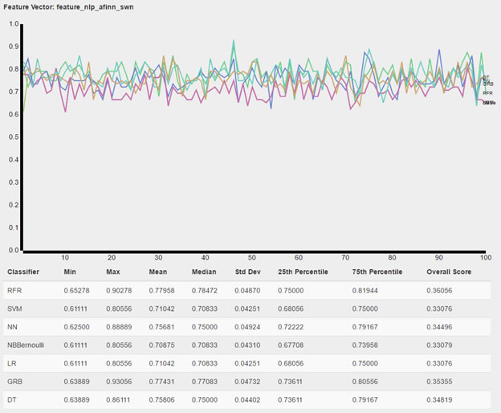

# [fyp_py](https://github.com/nossbigg/fyp_py) 
Source code for **A Study on Rumour Detection on Online Social Networks** final year research project.

## Abstract
This study seeks to identify the key traits of rumours on online social networks such as Twitter and Facebook. The importance of automating the identification of rumours is growing ever-increasingly important, given the rise of the internet’s popularity as a source of news, and the ever-growing amount of information on the internet. 
A set of qualitative and quantitative metrics were developed to better understand the characteristics of each search query and the resultant dataset that it generates. The quantitative metrics indicate the size of the dataset, and the qualitative metrics evaluate the News/Rumour Purity and Contextual Purity of a dataset. The metrics will indicate how much preprocessing effort a dataset requires to dissect the different contexts from a dataset, and to make it more useful for further analysis.
Leveraging on existing literature from both Computer Science and from the Social Sciences, three experiments were formulated:
1.	What are the general sentiment profiles of the datasets?
2.	How well can rumours and non-rumours be separated in rumour-centric datasets?
3.	How well can rumours and non-rumours be separated using all datasets?

The findings from the experiments indicate the following trends:
1.	Features generated from sentiment analysis libraries such as SentiWordNet and AFINN can be as reliable as features generated from a tf-idf model, in terms of resultant classifier performance.
2.	Tweets with a high proportion of neutral-sentiment words and a high proportion of punctuations are more likely to be related to the key contexts of their respective datasets.
3.	Rumours and non-rumours can be separated with a high degree of accuracy, in the case of having two predefined but significantly different types of datasets (ie. One is rumour-centric, the other is news-centric)

Through the course of this project, several custom software was developed. An Android information harvester was developed to automate the task of collecting tweets. A tweet processing and analysis software were developed to automate the testing for the experiments. Lastly, A web user interface for data visualisation was developed to easily gain insights from the experiment results.

## Key Features
* 70%+ accuracy in identifying rumors in homogeneous rumor/non-rumor tweet dataset using features generated from sentiment analysis libraries  

* Full data pipeline using MongoDB, pandas, NLTK, and scikit
* Usage of sentiment analysis tools such as AFINN, SentiWordNet, and Part-of-Speech Tagger
* Usage of machine learning models such as LR, SVM, NB, DT, GRB, RFR, and NN

## Report and Presentation 
Links to full report and presentation
* [Full Report](documentation/Report.pdf)
* [Presentation](documentation/Presentation.pdf)

## Related Projects
* [fyp_py_web](https://github.com/nossbigg/fyp_py_web): Web front-end for experiment results visualization and analysis
* [fyp_tweet_harvester](https://github.com/nossbigg/fyp_tweet_harvester): Android-based tweet harvester
